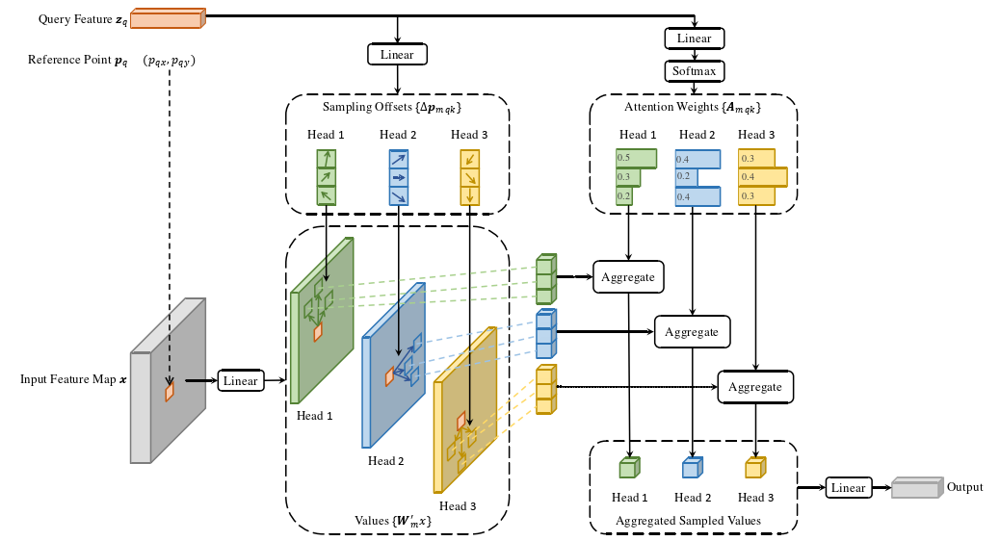

# Model architecture


## Code Installation

First, clone the repository locally:
```shell
git clone https://github.com/hotonbao/DETR-custom-coco.git
```
Move to the project directory
```shell
cd .\DETR-custom-coco\
```
## Dowload COCO dataset format Streeview follow below link:

```shell
https://universe.roboflow.com/fsmvu/street-view-gdogo/dataset/3#
```
Extract the dataset and move to the data folder like below folder tree:
```
root/
└── data/
    ├── test/
    |   ├──_annotations.coco.json 
    |   ├──img1.jpg 
    |   ├──img2.jpg 
    |   ├──...jpg 
    ├── train/
    |   ├──_annotations.coco.json 
    |   ├──img1.jpg 
    |   ├──img2.jpg 
    |   ├──...jpg 
    ├── valid/     
    |   ├──_annotations.coco.json 
    |   ├──img1.jpg 
    |   ├──img2.jpg 
    |   ├──...jpg 
└── detr/
    ├──d2/
    ├──dataset/
    ├──models/
    ├──output/
    ├──ultil
    ├──...

```


Training with data format COCO 6 class vehicles:
- batch size: 8
- epochs: 20
- device: 'cuda' or 'cpu'
- output: save weight directory
```shell
python main.py --dataset_file vehicle --data_path ../data/ --batch_size 8 --epochs 20 --device cuda --output_dir output  
```


## Evaluate on the test set

 ## DETR
| Metric            | IoU         | Area    | Max Dets | Value |
|-------------------|-------------|---------|----------|-------|
| Average Precision | 0.50:0.95   | all     | 100      | 0.506 |
| Average Precision | 0.50        | all     | 100      | 0.738 |
| Average Precision | 0.75        | all     | 100      | 0.541 |
| Average Precision | 0.50:0.95   | small   | 100      | 0.172 |
| Average Precision | 0.50:0.95   | medium  | 100      | 0.542 |
| Average Precision | 0.50:0.95   | large   | 100      | 0.724 |
| Average Recall    | 0.50:0.95   | all     | 1        | 0.370 |
| Average Recall    | 0.50:0.95   | all     | 10       | 0.567 |
| Average Recall    | 0.50:0.95   | all     | 100      | 0.593 |
| Average Recall    | 0.50:0.95   | small   | 100      | 0.252 |
| Average Recall    | 0.50:0.95   | medium  | 100      | 0.626 |
| Average Recall    | 0.50:0.95   | large   | 100      | 0.779 |

## YOLOv8l
| Metric            | IoU         | Area    | Max Dets | Value |
|-------------------|-------------|---------|----------|-------|
| Average Precision | 0.50:0.95   | all     | 100      | 0.762 |
| Average Precision | 0.50        | all     | 100      | 0.936 |

### General evaluation: 
The model does not have good performance in detecting small objects. Probably because Feature Pyramid Network is not used. Difficult to converge. When training for 5 epochs, no objects can be detected even though there are only 6 classes.

## Inference Onnx with TensorrtExecutionProvider:

GPU: RTX2060 max-Q
### Inference time: 17ms ###

| Model|Params|Inference time|
|------|------|--------------|
|YOLOv8l|43m|25ms|
|DETR|42m|17ms|

# Deformable DETR



### The model overcomes the disadvantages of DETR ###
     Use feature pyramid network, reference point.
